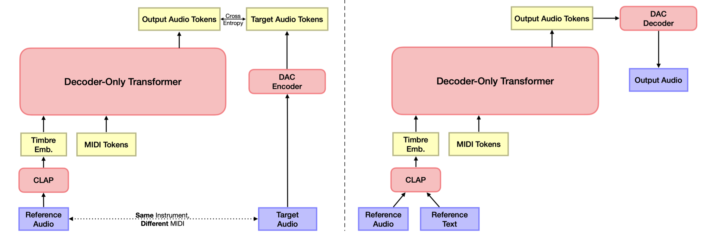

# TokenSynth: A Token-based Neural Synthesizer for Instrument Cloning and Text-to-Instrument
[](https://github.com/KyungsuKim42/tokensynth/actions)
[](https://pypi.org/project/tokensynth/)
[](https://github.com/KyungsuKim42/tokensynth/blob/main/LICENSE)


<div align="center">

[Kyungsu Kim](https://scholar.google.com/citations?user=bCMZWFIAAAAJ&hl=en&oi=sra), [Junghyun Koo](https://scholar.google.com/citations?user=9LbxECcAAAAJ&hl=en), [Sungho Lee](https://scholar.google.com/citations?hl=en&user=8yMXL5AAAAAJ), [Haesun Joung](https://scholar.google.com/citations?hl=en&user=yV8xVKoAAAAJ), [Kyogu Lee](https://scholar.google.com/citations?user=Fk4jQFEAAAAJ&hl=en)

📄 Paper (In Press) | 🎵 [Demo Page](http://tinyurl.com/tokensynth-demo)

</div>

This is the **official implementation** of "TokenSynth: A Token-based Neural Synthesizer for Instrument Cloning and Text-to-Instrument", accepted to **ICASSP 2025** (in press).

TokenSynth is a token-based neural synthesizer that generates polyphonic single-instrument musical audio from MIDI and timbre embeddings, enabling instrument cloning, text-to-instrument synthesis, and timbre manipulation. It uses a decoder-only transformer trained on neural audio tokens with CLAP-based timbre conditioning, allowing for flexible sound design without fine-tuning.

## Installation

To install TokenSynth, simply run:

```bash
pip install tokensynth
```

## Quickstart

```python
from tokensynth import TokenSynth, CLAP, DACDecoder
import audiofile
import torch

# Set file paths
ref_audio = "media/reference_audio.wav"
midi = "media/input_midi.mid"

# Initialize models
device = torch.device("cuda" if torch.cuda.is_available() else "cpu")
synth = TokenSynth.from_pretrained(aug=True)
clap = CLAP(device=device)
decoder = DACDecoder(device=device)

with torch.no_grad():
    # Extract timbre embeddings from audio and text
    timbre_audio = clap.encode_audio(ref_audio)
    timbre_text = clap.encode_text("warm smooth electronic bass")
    timbre_audio_text = 0.5 * timbre_audio + 0.5 * timbre_text

    # Generate audio tokens
    tokens_audio = synth.synthesize(timbre_audio, midi, top_k=10)
    tokens_text = synth.synthesize(timbre_text, midi, top_p=0.6, guidance_scale=1.6)
    tokens_audio_text = synth.synthesize(timbre_audio_text, midi, top_p=0.6, guidance_scale=1.6)

    # Decode tokens into audio waveforms
    audio_audio = decoder.decode(tokens_audio) 
    audio_text = decoder.decode(tokens_text)
    audio_audio_text = decoder.decode(tokens_audio_text)

# Save audio files
audiofile.write("media/output_audio.wav", audio_audio.cpu().numpy(), 16000)
audiofile.write("media/output_text.wav", audio_text.cpu().numpy(), 16000)
audiofile.write("media/output_audio_text.wav", audio_audio_text.cpu().numpy(), 16000)
```

You can also run `python quickstart.py` from the project root directory.

## Citation

A formal citation (BibTeX) will be available once this work is published.

For now, please cite this repository as:

```markdown
Kyungsu Kim, Junghyun Koo, Sungho Lee, Haesun Joung, Kyogu Lee.
TokenSynth: A Token-Based Neural Synthesizer for Instrument Cloning and Text-to-Instrument.
GitHub repository, 2024. Available at: https://github.com/kyungsukim42/tokensynth
```